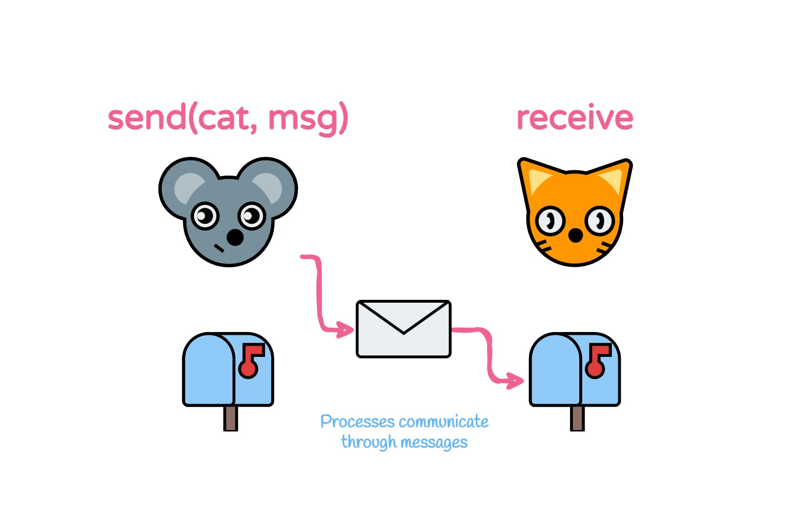

# Process communication in Elixir



This is the repository with code of the article [Process communication in Elixir](https://dev.to/thiagoslima/process-communication-in-elixir-3hg). Here you can access all the scripts you saw there.

To run a script just navigate to the folder and run:
```bash
$ elixir mouse.exs
```